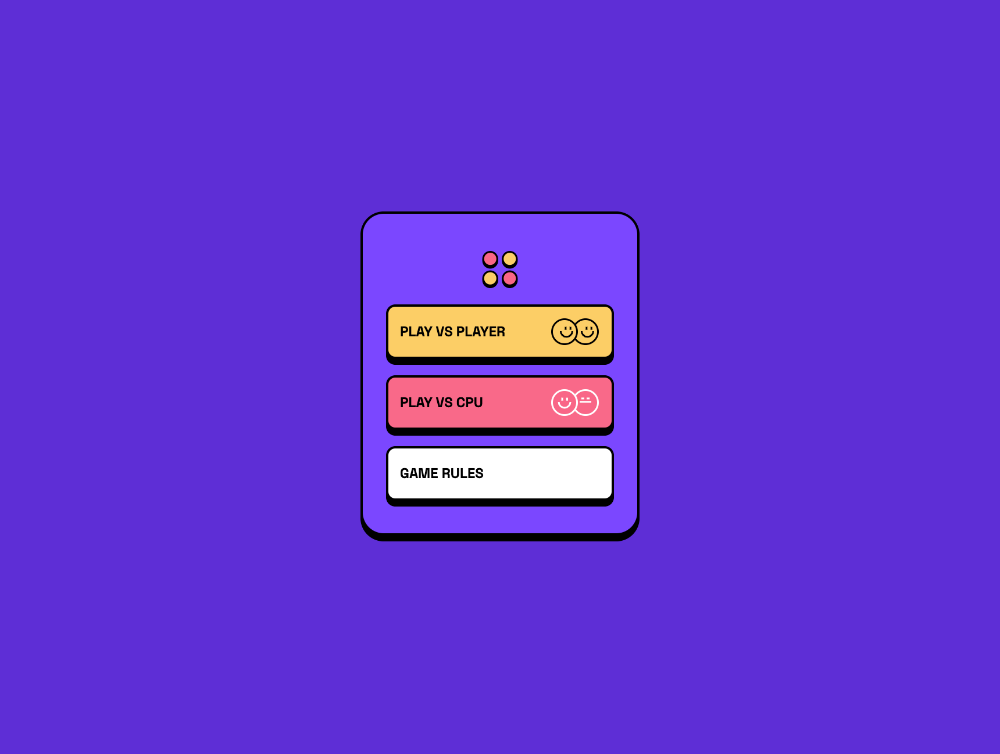
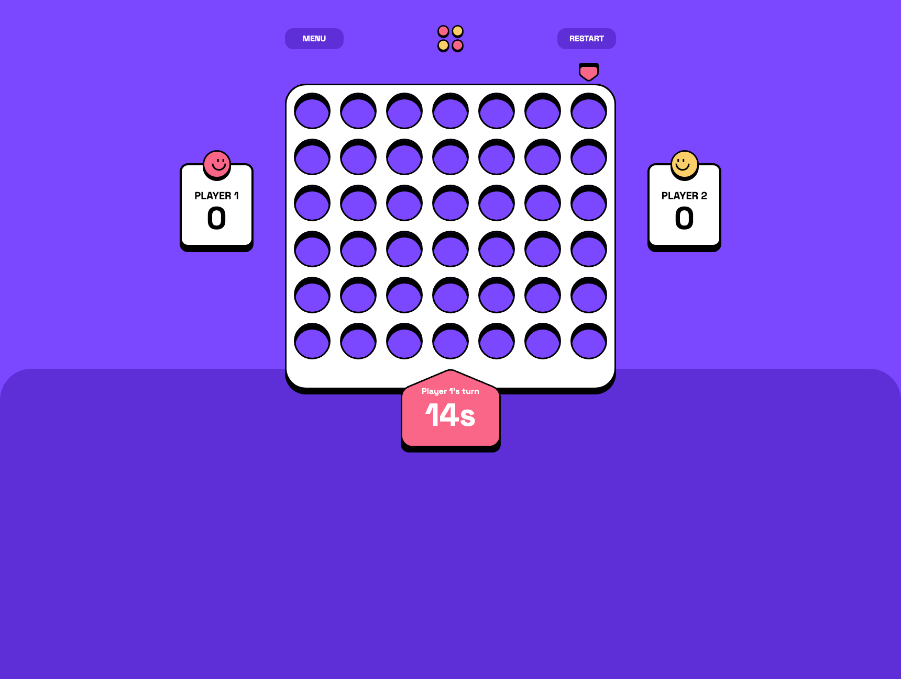
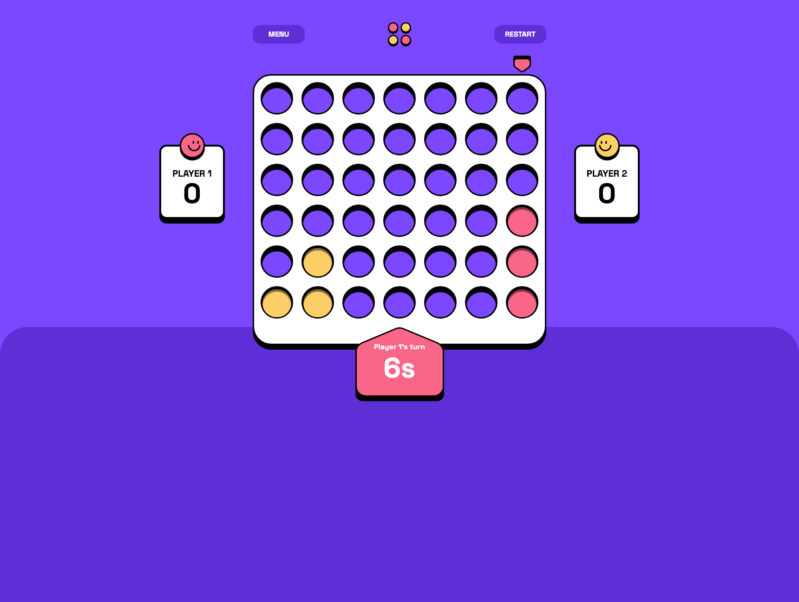
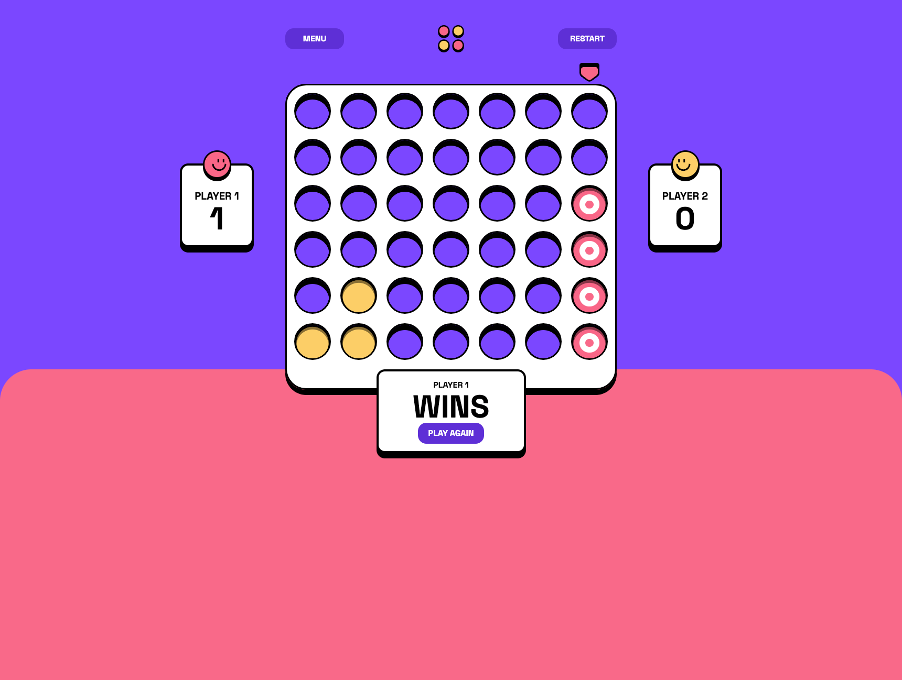

# Connect-4

A simple connect-4 game that can be played with a friend or with an AI. First to connect 4 pucks is the winner !

## Table of contents

- [Overview](#overview)
  - [The challenge](#the-challenge)
  - [Screenshot](#screenshot)
  - [Links](#links)
- [My process](#my-process)
  - [Built with](#built-with)
  - [What I learned](#what-i-learned)
  - [Useful resources](#useful-resources)

## Overview

### The challenge

Users should be able to:

- View the game rules
- Play a game of Connect-4 against another human player (alternating turns on the same computer)
- View the optimal layout for the interface depending on their device's screen size
- See hover and focus states for all interactive elements on the page
- See the discs animate into their position when a move is made
- Play against the computer

### Screenshot






### Links

- Live Site URL: [Connect-4](https://connect-four-kappa.vercel.app/)

## My process

### Built with

- [React](https://react.dev/)
- [Zustand](https://github.com/pmndrs/zustand)
- [Framer Motion](https://www.framer.com/motion/)
- [Tailwind](https://tailwindcss.com/)

### What I learned

#### State Management

##### The Challenge with useState + useContext

Initially, useState and useContext were employed for state management. However, the project quickly became cluttered with too many useState hooks, making the logic convoluted and challenging to understand. Additionally, this approach would necessitate prop drilling to pass state and state-modifying functions between components, leading to a more complex and less maintainable codebase.

##### Issues with useReducer + useContext

To ameliorate the issues with the initial approach, useReducer and useContext were implemented. Unfortunately, this resulted in its own set of challenges, with useContext causing excessive re-renders. While multiple useContexts could be used to isolate each dispatch and state, this workaround conflicted with the objective of simplifying the logic and codebase. Additionally, utilizing React.memo to optimize performance was contradictory to the desired architectural design, as it would still necessitate prop drilling.

##### Zustand: A Suitable Solution

After evaluating the previous approaches, Zustand was identified as the optimal solution for state management. Zustand allows consumption of specific store elements, triggering re-renders only when the consumed elements change. Its simplicity and ease of understanding facilitated a quick learning curve.

```js
export const useStore = create((set) => ({
  scoreP1: 0,
  scoreP2: 0,
  turn: 'P1',
  finished: false,
  matrix: createMatrix(6, 7),
  pause: false,
  time: 15,
  winner: '',

  restart: () =>
    set({
      scoreP1: 0,
      scoreP2: 0,
      turn: 'P1',
      finished: false,
      matrix: createMatrix(6, 7),
      pause: false,
      time: 15,
      winner: '',
    }),

  togglePause: () => set((state) => ({ pause: !state.pause })),

  changeTurn: () =>
    set((state) => ({
      turn: state.turn === 'P1' ? 'P2' : 'P1',
      time: 15,
    })),

  updateMatrix: (matrix) => set({ matrix }),

  finish: (winner) =>
    set((state) => ({
      finished: true,
      winner,
      scoreP1: winner !== 'tie' && winner === 'P1' ? state.scoreP1 + 1 : state.scoreP1,
      scoreP2: winner !== 'tie' && winner === 'P2' ? state.scoreP2 + 1 : state.scoreP2,
    })),

  countDown: () => set((state) => ({ time: state.time - 1 })),

  replay: () =>
    set((state) => ({
      turn: state.turn === 'P1' ? 'P2' : 'P1',
      finished: false,
      matrix: createMatrix(6, 7),
      pause: false,
      time: 15,
    })),
}))
```

#### Component Structure and Performance

##### Effective Component Splitting

In addressing performance issues, particularly re-rendering times, the ‘Playboard’ component was decomposed into three subcomponents, resulting in a 30% reduction in re-rendering time. Conventionally, splitting is advised when components exceed 150 lines of code. However, in this case, the ‘Playboard’ component, consisting of approximately 70-90 lines, necessitated splitting due to a frequently modified state-array, causing unnecessary re-renders in unrelated parts of the component.

#### Codebase Management

##### Regular Codebase Clean-Up

Maintaining a clean and organized codebase was pivotal for the project's long-term viability and developer productivity. Regular refactoring sessions were conducted to remove redundant code and optimize existing implementations. This practice ensured that the codebase remained manageable, facilitating easier feature additions and bug fixes.

### Useful resources

- [React Docs](https://react.dev/reference/react)
- [Zustand Docs](https://docs.pmnd.rs/zustand/getting-started/introduction)
